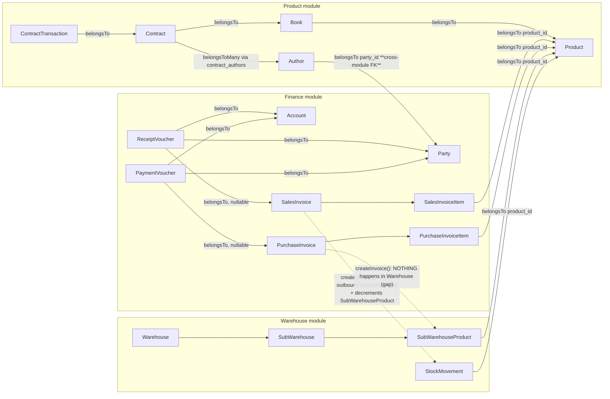
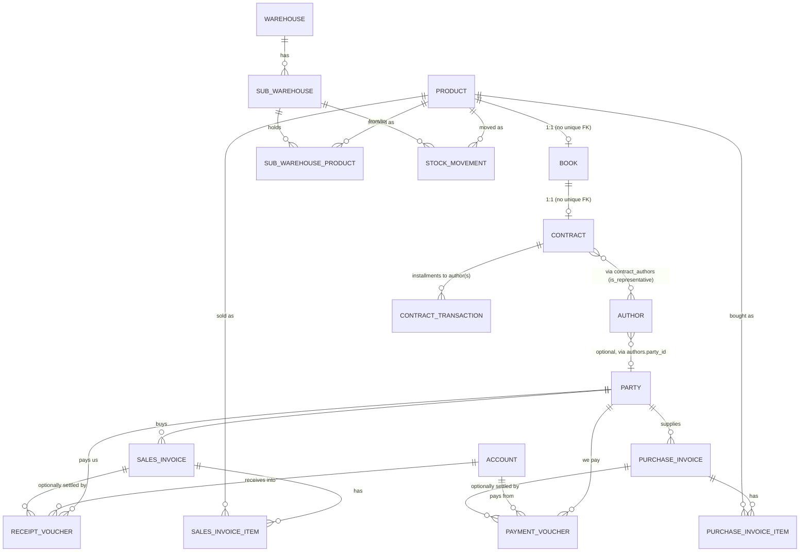
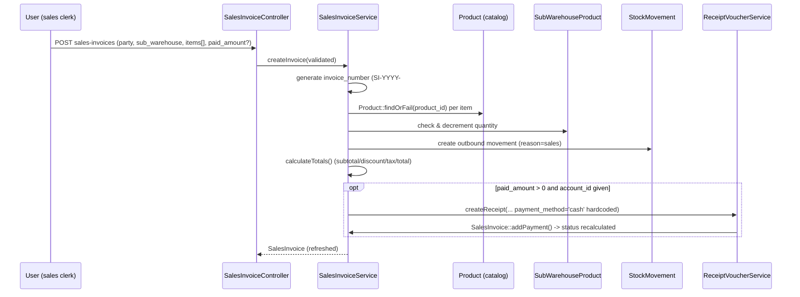
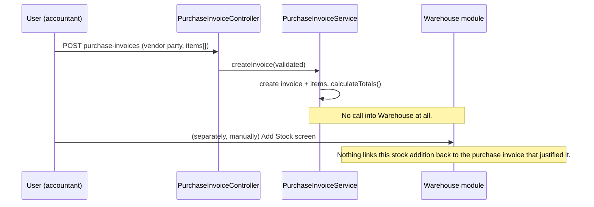

# Finance, Product & Warehouse Modules — Architecture & Business Logic Deep Dive

> Scope: this document explains, in detail and based on the actual code (not the older stale
> module READMEs), how the **Finance**, **Product**, and **Warehouse** modules work today, how
> they are wired together, where the wiring is fragile, and concrete suggestions to improve both
> the architecture and the business logic. Every claim below is backed by a specific file so it
> can be verified/re-checked quickly.
>
> Note: `Modules/Product/README.md` and `Modules/Product/docs/README.md` describe an **older**
> single-author schema (`author_id` on `books` and `author_book_contracts`). That schema was
> refactored to a multi-author model (see §3.5). Treat those two files as historical, not current.

---

## 1. System context

This is a Laravel 11 application using **[nwidart/laravel-modules](https://github.com/nWidart/laravel-modules)**.
Each business domain lives in `Modules/<Name>` with its own `app/`, `database/migrations`,
`routes/`, `resources/views`, and `resources/lang`, but all modules share **one database** and
**freely `use` each other's Eloquent models across namespaces** — there is no service boundary,
no API contracts, and no event bus between modules. This is the single most important
architectural fact to understand: *modules are a folder/namespace convention, not a decoupling
mechanism.*

Modules present in the repo: `Customer`, `Finance`, `HR`, `Product`, `SearchDrawer`, `Settings`,
`Warehouse`. This document covers **Finance**, **Product**, and **Warehouse** (per request), and
touches `Customer` and `Settings` only where they intersect.

---

## 2. Product Module

**Purpose:** catalog of sellable products (mainly books), author profiles, author↔book publishing
contracts, and installment payments made *to* authors against those contracts. This is the
publishing-house side of the business (acquiring content), as opposed to Finance, which is the
selling/buying side.

### 2.1 Current schema

| Table | Key columns | Notes |
|---|---|---|
| `products` | `name`, `type` (`book,ebook,journal,course,bundle`), `sku`, `base_price`, `status` (`active,inactive`) | Generic sellable item. `Modules/Product/database/migrations/2025_11_18_000001_create_products_table.php` |
| `book_categories` | `name`, `parent_id` (self-FK) | 2-level-in-practice hierarchy (parent/child), no depth limit enforced. |
| `authors` | `full_name`, contact fields, `id_image`, **`party_id`** (nullable FK → `parties`) | `party_id` added later — see §2.4. `2026_04_24_183130_add_party_id_to_authors_table.php` |
| `books` | `product_id` (FK, cascade), `category_id`, `sub_category_id`, `isbn`, `cover_type`, translation fields | **No `author_id` anymore** — removed in the multi-author refactor (§3.5 below uses §5 numbering, see §2.5). 1:1 with `products` by convention (no DB unique constraint enforcing it, see §2.6). |
| `author_book_contracts` (model `Contract`) | `book_id` (nullable FK), `book_name` (free text fallback), `contract_date`, `contract_price`, `percentage_from_book_profit`, `contract_file` | **No `author_id` column anymore** — replaced by pivot. |
| `contract_authors` (pivot) | `contract_id`, `author_id`, `is_representative` (bool) | Many-to-many; unique on `(contract_id, author_id)`. |
| `author_contract_transactions` (model `ContractTransaction`) | `contract_id`, `amount`, `payment_date`, `receipt_file` | Installments paid *to* the author(s) against `contract_price`. |

### 2.2 Models & relationships (as the code actually is today)

- **`Product`** (`app/Models/Product.php`) — `hasOne(Book)`, `creator/editor`. Scopes `active()`,
  `byType()`. No relation at all to `SalesInvoiceItem`/`SubWarehouseProduct` from this side —
  those live on the Finance/Warehouse models pointing *at* `Product` (see §5).
- **`Book`** (`app/Models/Book.php`) — `belongsTo(Product)`, `belongsTo(BookCategory)` (x2, main +
  sub), **`hasOne(Contract)`**. There is **no `author()` relation any more**. Authors are reached
  via `$book->contract->authors` or the `getAuthorsAttribute()` accessor
  (`$this->contract ? $this->contract->authors : collect()`), and there's a convenience
  `getAuthorsNamesAttribute()` that joins names with an Arabic comma (`، `).
- **`Contract`** (table `author_book_contracts`) — `belongsToMany(Author, 'contract_authors')`
  with pivot `is_representative`, `belongsTo(Book)`, `hasMany(ContractTransaction)`. Computed:
  `total_paid`, `outstanding_balance`, `payment_percentage`, `payment_status`
  (`paid|partial|pending`), `isFullyPaid()`.
- **`Author`** (`app/Models/Author.php`) — `belongsToMany(Contract, 'contract_authors')`,
  `belongsTo(Modules\Finance\Models\Party, 'party_id')` — **a direct cross-module FK/relation into
  Finance**. Computed `total_contract_value`, `total_paid`, `outstanding_balance` (auto-appended to
  JSON via `$appends`, so every serialization of an `Author` runs these aggregate queries — see
  §8). Also carries Finance-flavoured helper methods directly on the model: `salesInvoices()`,
  `receiptVouchers()`, `paymentVouchers()`, `giftCopies()` — all of which `use Modules\Finance\...`
  and manually query Finance tables by `party_id` (not real Eloquent relations, just ad-hoc
  queries returning collections).
- **`ContractTransaction`** — `belongsTo(Contract)`, scopes `forContract`, `thisMonth`, `thisYear`.
- **`BookCategory`** — self-referencing `parent()`/`children()`, `full_name` accessor
  (`"Parent > Child"`), `is_parent`.

### 2.3 Core business logic

1. **Book creation** (`BookController::store`) creates a `Product` row and a `Book` row in two
   separate `Model::create()` calls with **no DB transaction** — if the second insert fails, an
   orphan `Product` with no `Book` is left behind (see §8).
2. **Contract creation** (`ContractService::createContract`) — *is* transactional. Accepts
   `author_ids[]` + a `representative_id`, force-adds the representative into the author list if
   missing, and syncs the `contract_authors` pivot with `is_representative` flags via
   `Contract::authors()->sync()`. Only one author is meant to be the representative, but this is
   an **application convention, not a DB constraint** — nothing stops two rows in
   `contract_authors` for the same contract from both having `is_representative = 1`, or none at
   all if a contract is edited outside `ContractService`.
3. **Contract deletion guard** — `ContractService::deleteContract()` throws if the contract has any
   `transactions()`, forcing money-in-flight contracts to stay.
4. **Payment (installment) validation** — `StoreTransactionRequest::withValidator()` blocks a new
   transaction if the contract is already fully paid, or if the new transaction would push total
   payments over `contract_price`. This is the module's only guard against author-side overpayment.
5. **Author → Customer bridge** — `AuthorController::registerAsClient()` creates a **new
   `Finance\Party`** (`type = individual`) from the author's name/email/phone and stores its id on
   `authors.party_id`. From that point the author is addressable as a normal customer: they can
   receive sales invoices, receipt vouchers, and payment vouchers, all looked up by `party_id`
   (`Author::salesInvoices()`, `receiptVouchers()`, `paymentVouchers()`).
6. **Gift copies** — `Author::giftCopies()` / `AuthorService::getAuthorStats()` define a "gift" as
   any `SalesInvoiceItem` for one of the author's own products where
   `discount_amount >= unit_price * quantity` (i.e. 100%+ discounted) — a *heuristic*, not an
   explicit `is_gift` flag.
7. **Bulk price update** (`BookController::bulkPriceUpdate`) streams NDJSON progress
   (`response()->stream`) while incrementing/decrementing every book's `base_price` by a fixed
   amount or percentage — a nice UX touch, but it loads **all** books into memory
   (`Book::with('product')->get()`) and does one `save()` per row with no transaction/batching.
8. **Import/Export** — `BooksImport`, `BooksExport`, `AuthorsFinancialExport`, plus two Artisan
   commands: `product:import-books` and **`product:split-authors`**, a one-off, hard-coded
   data-migration command listing ~110 legacy book IDs whose author field was a single
   comma-joined string (e.g. `"د. فلان ,د. علان"`) and splitting it into proper `Author` rows +
   `contract_authors` pivot entries. This command is direct evidence of the schema history
   described next.

### 2.4 The `party_id` bridge in detail

`Author.party_id` (nullable FK → `parties`) is the **only** structural link from Product into
Finance's customer/vendor model. It is optional — most authors have `party_id = null` and are pure
"content suppliers." Only authors who have also bought something (e.g. their own book, as a gift
or at a discount) get promoted to a `Party` via `registerAsClient()`.

### 2.5 Schema evolution: single-author → multi-author

Originally (per `Modules/Product/docs/README.md`, now stale): `books.author_id` and
`author_book_contracts.author_id` were plain FKs — one author per book/contract. Two migrations
changed this:

- `2026_04_19_200536_create_contract_authors_table.php` — adds the `contract_authors` pivot.
- `2026_04_19_200655_udpate_authors_table.php` *(sic, typo in filename)* — backfills the pivot
  from the old `author_id` columns (marking the sole author as `is_representative = true`), then
  **drops `author_id` from both `books` and `author_book_contracts`**.

This is a real, executed refactor (multi-author books/contracts are now first-class), but the
refactor's blast radius was **not fully cleaned up** — several other modules still read the old,
now-nonexistent `Book::author()` relation. See §6 and §8.1 for the concrete list.

### 2.6 Known issues local to Product

- **No unique constraint tying one `Contract` to one `Book`.** `Book::contract()` is `hasOne`, but
  `author_book_contracts.book_id` has no unique index, so nothing in the database stops two
  contracts pointing at the same `book_id`; Eloquent will just silently return whichever row it
  finds first via `hasOne`, hiding the second contract from the UI while it still exists and could
  still accrue payments.
- **`is_representative` is not DB-enforced.** Nothing prevents zero or multiple representatives
  per contract if the pivot is touched outside `ContractService::syncAuthors()`.
- **`StoreContractRequest::rules()`** requires `book_name` unconditionally (`'required|string'`)
  even when a real `book_id` is also supplied — the two can drift (e.g. `book_name` says one title,
  `book_id` points to a different book) since nothing keeps them in sync.
- **`StoreTransactionRequest::withValidator()`** calls `$contract->contract_price` before checking
  `$contract` is non-null in the first `if`; if `contract_id` fails the `exists` rule, `$contract`
  can be `null` here (PHP 8 turns this into a silent `null` read, not a crash, but it's fragile and
  the intent is clearly to guard first).
- **`Book` create/update split across two non-transactional model calls** in `BookController` —
  a failure between the `Product::create()` and `Book::create()` calls leaves an orphaned product.

---

## 3. Finance Module

**Purpose:** the actual accounting layer — customers/vendors (`Party`), cash/bank `Account`s,
`SalesInvoice`/`PurchaseInvoice` (with line items against `Product`), and `ReceiptVoucher`/
`PaymentVoucher` (cash in/out against those invoices).

### 3.1 Schema

| Table | Key columns | Notes |
|---|---|---|
| `parties` | `name`, `type` (`individual,company,online`), `is_active` | One table for **both** customers and vendors — role is derived, not stored (see §3.3). No `opening_balance` column. |
| `accounts` | `account_name`, `account_type` (`cash,bank`), bank fields, `opening_balance`, `currency` | Cash/bank drawers that receipts/payments move through. |
| `sales_invoices` | `invoice_number` (unique), `party_id`, `subtotal`, `discount_type`(`fixed|percentage`)/`discount_value`, `is_taxable`/`tax_rate`/`tax_amount`, `total_amount`, `paid_amount`, `status`, soft-deletes | |
| `sales_invoice_items` | `sales_invoice_id`, `product_id`, `quantity` (int), `unit_price`, `discount_amount`, `line_total` | Snapshots `product_name`/`product_sku` at time of sale. |
| `purchase_invoices` | mirrors sales, but only a flat `discount_amount` (**no percentage option**), plus `outstanding_balance` **stored as a column** (unlike sales, where it's a computed accessor) | |
| `purchase_invoice_items` | same shape as sales items, but `quantity` is cast **`decimal:2`** (fractional purchase quantities allowed) vs sales items' `quantity` cast **`integer`** | |
| `receipt_vouchers` | `party_id`, `account_id`, `sales_invoice_id` (nullable), `amount`, `payment_method` | Money **in**. |
| `payment_vouchers` | `party_id`, `account_id`, `purchase_invoice_id` (nullable), `amount`, `cheque_number/date` | Money **out**. |

### 3.2 Models: balances are computed, not stored (mostly)

Almost every "balance" in Finance is a live aggregate, not a persisted ledger row:

- `Account::current_balance` = `opening_balance + SUM(receipt_vouchers.amount) - SUM(payment_vouchers.amount)`,
  computed on every access via `getCurrentBalanceAttribute()`.
- `SalesInvoice::outstanding_balance` = `total_amount - paid_amount` (accessor).
- `Party::customer_balance` = `(SUM(sales) - SUM(receipts)) - (SUM(purchases) - SUM(payments))`,
  i.e. a **combined** net position across both customer and vendor sides of the same party.
  `Party::vendor_balance` is the purchase-side-only variant.
- `Party` has a deliberate **N+1 guard**: `getCustomerBalanceAttribute()` etc. check
  `hasPreloadedSums()` first and use `withSum()`-preloaded columns (`total_sales`,
  `total_receipts`, `total_purchases`, `total_payments`) when the caller preloaded them (see
  `PartyService::findWithAggregates()` and `PartyController::index()`), falling back to live
  per-row queries otherwise. This is a genuinely good pattern — but it is **manually duplicated**
  in every accessor rather than centralized once.

### 3.3 Party = Customer + Vendor, unified

There is **no separate Customer/Vendor entity**: `Party.type` is just `individual/company/online`
(a *contact* type, not a role), and "is this a customer" / "is this a vendor" is entirely derived
from whether the party has any `sales_invoices` or `purchase_invoices` rows
(`getIsCustomerAttribute()`/`getIsVendorAttribute()`, and scopes `scopeCustomers()`
`whereHas('salesInvoices')` / `scopeVendors()` `whereHas('purchaseInvoices')`). A party can be both
at once (e.g. an author who is also a buyer of their own book — see §2.4/§5).

### 3.4 Invoice lifecycle & services

**Sales invoice creation** (`SalesInvoiceService::createInvoice`, fully wrapped in
`DB::transaction`):
1. Generates `invoice_number` as `SI-{year}-{5-digit sequence}` by reading the **last row's
   number + 1** (`generateInvoiceNumber()` — see §8, race condition).
2. Resolves `tax_rate` from `Modules\Settings\Models\OrganizationSetting` when taxable and no rate
   was supplied.
3. Creates the invoice with zeroed totals, then for each line item: looks up the `Product`,
   snapshots `product_name`/`product_sku` onto the item, computes `line_total`, and — if a
   `sub_warehouse_id` was submitted — **decrements `SubWarehouseProduct.quantity` and writes a
   `StockMovement` row** (`movement_type = outbound`, `reason = sales`) inline, throwing if stock
   is insufficient.
4. Calls `SalesInvoice::calculateTotals()` (subtotal from items → discount → tax → total).
5. If `paid_amount` + `account_id` were supplied, immediately creates a `ReceiptVoucher` (hardcoded
   `payment_method = 'cash'` regardless of the real method) via `ReceiptVoucherService`.

**Sales invoice update** does the same, but first **reverses all prior `sales`-reason
`StockMovement`s** for the invoice (adds the quantity back via `firstOrCreate` on
`SubWarehouseProduct`, deletes the movement rows), deletes all old items, then re-creates
items/movements from scratch. This means editing an invoice with 1 line item does a full
delete+reinsert of stock history rather than a diff.

**Cancel/Activate** (`cancelInvoice`/`activateInvoice`) are the only two methods in the whole
Finance module that use **`lockForUpdate()`** on both the invoice and the affected
`SubWarehouseProduct` rows, to avoid races. `cancelInvoice` refuses to run if `paid_amount > 0`,
reverses stock, and also writes an explicit **audit** `StockMovement` with
`reason = 'sales_cancel'` (in addition to restoring the row) — so cancelling an invoice produces
*two* records: the balance is restored via `SubWarehouseProduct`, and a movement row documents
*why*. `activateInvoice` re-applies the deduction and recomputes `status` from
`paid_amount`/`total_amount` manually (duplicating `updatePaymentStatus()`'s logic instead of
calling it).

**Purchase invoices** (`PurchaseInvoiceService`) mirror sales invoices for numbering
(`PI-{year}-{seq}`), tax, and item creation, with one extra feature sales invoices don't have:
a **`manual_amount`** path for invoices with no line items at all (e.g. paying a service/expense
to a vendor) — subtotal is just set to that number and tax/discount applied on top. Critically,
**`PurchaseInvoiceService` never touches `Warehouse` at all** — buying stock through a purchase
invoice does **not** increase `SubWarehouseProduct.quantity` or write any `StockMovement`. The only
way stock enters the system is the Warehouse module's own manual "Add Stock" screen (§4.3). This
is a significant business-logic gap for a business that (presumably) buys books/products from
authors/printers and needs that to show up as available inventory — see §8.

**Receipt/Payment vouchers** (`ReceiptVoucherService`/`PaymentVoucherService`) are thin: generate a
sequential voucher number, create the row, and if a `sales_invoice_id`/`purchase_invoice_id` is
attached, call `invoice->addPayment($amount)` which does `paid_amount += amount` then recomputes
`status`. Update/delete correctly reverse the old amount off the invoice before applying the new
one. None of this is guarded by row locking, unlike cancel/activate on sales invoices.

### 3.5 Party account statement ("كشف حساب")

`PartyController::accountStatement()`/`printAccountStatement()` build a **synthetic running
ledger** entirely in PHP: pull sales invoices (debit), purchase invoices (credit), receipt
vouchers (credit), payment vouchers (debit) for a date range into one collection, `sortBy('date')`,
then `array_reduce`-style accumulate a running balance. `opening_balance` is **hard-coded to `0`**
— there is no column on `parties` to seed a real historical opening balance, so any party who had
a balance before this system went live cannot have an accurate statement.

### 3.6 Known issues local to Finance

- **Invoice numbering race condition.** `generateInvoiceNumber()` (both services) does
  `ORDER BY id DESC LIMIT 1` then `+1`, with no locking. Two concurrent invoice creations can
  compute the same number; the `unique()` DB constraint will then reject the second `INSERT`,
  surfacing as a raw exception to the user instead of a friendly retry.
- **Sales invoices can be edited while `status = paid`.** `SalesInvoiceController::edit()` only
  blocks `status === 'cancelled'`; `PurchaseInvoiceController::edit()` blocks
  **both** `paid` and `cancelled`. So a paid sales invoice's line items can be changed,
  `calculateTotals()` will change `total_amount`, but nothing re-runs `updatePaymentStatus()`
  afterward — a "paid" invoice can end up with `total_amount > paid_amount` while still labelled
  paid.
- **Hardcoded `payment_method = 'cash'`** when a `ReceiptVoucher`/`PaymentVoucher` is
  auto-created from an invoice's `paid_amount` field, even though the voucher schema supports
  `bank_transfer`, `cheque`, etc. — the invoice forms never actually collect the real method for
  that inline payment.
- **Asymmetric discount model**: sales invoices support `fixed` or `percentage` discount
  (`discount_type`/`discount_value`), purchase invoices only support a flat `discount_amount`.
- **Asymmetric quantity precision**: `SalesInvoiceItem.quantity` is an integer,
  `PurchaseInvoiceItem.quantity` is `decimal:2` — the same `Product` can be sold only in whole
  units but purchased fractionally.
- **No row locking on the common create/update paths** (only cancel/activate lock) — concurrent
  sales against the same `SubWarehouseProduct` row can both pass the "enough stock?" check before
  either commits, causing oversell.
- **`ReceiptVoucherService`/`PaymentVoucherService` never touch `Account`.** The comment `// Balance
  is calculated dynamically, no need to update` is correct for *reading* the balance, but it means
  there's no persisted per-transaction running balance on the account itself — fine at small
  scale, increasingly expensive as vouchers accumulate (every `current_balance` read is two full
  `SUM()` scans).

---

## 4. Warehouse Module

**Purpose:** physical stock tracking. `Warehouse` → `SubWarehouse` (a physical location/branch/
book-fair stand) → `SubWarehouseProduct` (quantity of a `Product` sitting in a given
`SubWarehouse`) → `StockMovement` (an audit-log row for every quantity change).

### 4.1 Schema / models

- **`Warehouse`** — top-level container (`name`, `description`). Computed `total_sub_warehouses`,
  `total_products`, `total_stock` (the last one does a raw `join` + `sum`).
- **`SubWarehouse`** — belongs to a `Warehouse`; `type` enum (`main,branch,book_fair,temporary,other`)
  — the `book_fair`/`temporary` types are a strong signal this system models a **publisher that
  sells physically at book fairs**, not just a fixed retail shop.
- **`SubWarehouseProduct`** — the actual stock row: `(sub_warehouse_id, product_id) → quantity`.
  `isLowStock()` (< 10, hardcoded threshold) / `isOutOfStock()` (≤ 0) helpers.
- **`StockMovement`** — append-only(-ish) log: `product_id`, `from_sub_warehouse_id`,
  `to_sub_warehouse_id`, `quantity`, `movement_type` (`inbound|outbound|transfer`), `reason`,
  `reference_id` (a loosely-typed FK — e.g. a `SalesInvoice.id` when `reason='sales'` — with no DB
  foreign key or polymorphic type column tying it to the right table), `user_id`.

### 4.2 Business logic

- **Add stock** (`SubWarehouseController::storeStock`) — bulk form, `firstOrCreate`s a
  `SubWarehouseProduct` per product and increments quantity, and writes one `inbound`
  `StockMovement` per line with `reason = 'Stock Addition'`. This is currently the **only** way
  stock legitimately enters the system (see §3.4's purchase-invoice gap).
- **Edit stock** (`SubWarehouseController::updateStock`) — a manual quantity override; diffs old vs
  new quantity and writes one corrective `StockMovement` (`reason = 'Stock Adjustment'`).
- **Stock movements (bulk create)** (`StockMovementController::store`) — supports `inbound`,
  `outbound`, and `transfer` in one form submission, each validated for sufficient source stock,
  wrapped in a single `DB::transaction`/`DB::beginTransaction()` for the whole batch.
- **Stock movements: update & destroy do NOT touch quantities.**
  `StockMovementController::update()` only patches the movement's own columns; `destroy()` only
  deletes the log row. Neither adjusts the corresponding `SubWarehouseProduct.quantity`. This means
  editing a movement's `quantity` after the fact, or deleting a movement, **silently desyncs the
  audit log from the actual stock balance** — the log will no longer reconcile to
  `SubWarehouseProduct.quantity`, and there is no reconciliation job to catch this.

### 4.3 Known issues local to Warehouse

- Stock is tracked **per `Product`**, not per book *edition*/condition — fine today (1 product per
  book), but will need a variant concept if e.g. hardcover vs paperback of the same title become
  separate SKUs sharing one `Product` row.
- `reference_id` on `StockMovement` has no type discriminator — a stock movement created from a
  sale (`reference_id` = sales invoice id) is structurally indistinguishable from one created from
  a future feature reusing the same numeric ids, other than by convention on the `reason` string.
- Low-stock threshold (`< 10`) is hardcoded in `SubWarehouseProduct::isLowStock()`, not configurable
  per product/organization.

---

## 5. How the three modules are actually linked

There is **no service layer or event bus** between modules — linkage is either (a) a real foreign
key + Eloquent relation, or (b) a bare `use Modules\X\Models\Y` cross-namespace import inside a
controller/service. Below is the concrete map.

### 5.1 Product ↔ Finance
- **Selling**: `SalesInvoiceItem.product_id` / `PurchaseInvoiceItem.product_id` both `belongsTo`
  `Modules\Product\Models\Product` directly (`Modules/Finance/app/Models/SalesInvoiceItem.php:8`,
  `PurchaseInvoiceItem.php:7`). Finance depends on Product's `Product` model for pricing (`name`,
  `sku`, `base_price` snapshotted at sale/purchase time) but not on `Book`/`Author` directly at the
  model level.
- **Author-as-customer**: `Author.party_id → Party.id` (nullable). This is the one real,
  persisted, cross-module foreign key in the whole codebase. It's how a `Book`'s author can become
  a paying customer for their own book (gift copies, discounted author copies, etc.) and get a real
  invoice/receipt trail, entirely through the generic `Party`/`SalesInvoice` machinery.
- **Controllers reach across modules constantly**: `Finance\SalesInvoiceController`,
  `PurchaseInvoiceController` both `use Modules\Product\Models\{Author, BookCategory, Product}` to
  populate filter dropdowns and the product picker — Finance's UI is directly coupled to Product's
  category/author shape.
- **Settings → Finance**: both invoice services pull `Modules\Settings\Models\OrganizationSetting`
  for the default `tax_rate`.

### 5.2 Finance ↔ Warehouse (asymmetric!)
- **Sales deduct stock.** `SalesInvoiceService` is the only Finance code that writes to
  `Warehouse\Models\{StockMovement,SubWarehouseProduct}` — every sales invoice line item with a
  `sub_warehouse_id` decrements stock and logs an `outbound` movement; cancelling/activating a
  sales invoice reverses/reapplies it.
- **Purchases do *not* add stock.** `PurchaseInvoiceService` never imports anything from
  `Modules\Warehouse`. Buying a book from a vendor/author and recording a `PurchaseInvoice` has
  zero effect on any `SubWarehouseProduct` row. Restocking is a fully separate, manual step via
  `Warehouse\SubWarehouseController::storeStock()`. In practice this means two independent
  processes have to happen for every purchase: (1) record the purchase invoice for accounting, and
  (2) separately go into Warehouse and manually add the same quantity — with nothing linking the
  two, so they can (and likely will) drift.

### 5.3 Product ↔ Warehouse
- `SubWarehouseProduct.product_id` and `StockMovement.product_id` both point at
  `Modules\Product\Models\Product`. Warehouse also reaches *through* `Product` into `Book` for
  display (`product->book->...`) in several places — and this is exactly where the stale
  `Book::author()` reference lives (next section).

### 5.4 The dangling `Book::author()` reference (cross-cutting regression)

When the multi-author refactor (§2.5) removed `Book::author()` and `books.author_id`, **every other
module that had already learned the singular "a book has one author" shape kept using it**. Since
Eloquent silently returns `null` for an undefined relation/attribute access instead of throwing,
these call sites don't crash — they just silently show "no author" from now on:

| File | What breaks |
|---|---|
| `Modules/Warehouse/app/Http/Controllers/StockMovementController.php:122-123` (`searchProducts`) | Author info in the product Select2 payload is always `null`. |
| `Modules/Warehouse/resources/views/sub_warehouses/edit_stock.blade.php:105-108` | Author name never renders on the stock-edit screen. |
| `Modules/Warehouse/resources/views/sub_warehouses/show.blade.php:145-146` | Same, on sub-warehouse detail. |
| `Modules/Warehouse/resources/views/stock_movements/show.blade.php:115-116` | Same, on movement detail. |
| `Modules/SearchDrawer/app/Http/Controllers/Api/ProductSearchController.php:67,91` | Global product search drawer never returns an author name. |
| `Modules/Finance/app/Http/Controllers/SalesInvoiceController.php:126,268` | `allProductsWithBooks` payload's `author_id`/`author_name` are always empty in the sales invoice item picker. |
| `Modules/Finance/app/Http/Controllers/PurchaseInvoiceController.php:122` | Same, in the purchase invoice item picker. |
| `Modules/Product/tests/Unit/BookTest.php:68-69`, `Modules/Product/tests/Feature/ProductModuleFeatureTest.php:75` | These tests assert `$book->author` works and **should now be failing** (or were already updated/skipped — worth confirming CI status). |

The *correct*, current accessor is `Book::authors` (plural, via `Book::getAuthorsAttribute()` →
`$book->contract->authors`) or `Book::authors_names`. This is a straightforward, mechanical, low-risk
fix (§7.2), but until it's done, author information is quietly missing from the warehouse UI, the
global search drawer, and both invoice item pickers — the exact places a librarian/salesperson
would expect to see it.

---

## 6. Cross-module data model (ER overview)

### 6.1 End-to-end flow: "sell a book"

### 6.2 End-to-end flow: "onboard an author, then sell them a copy of their own book"

1. Author is created in Product (`AuthorController::store`) — no Finance record yet.
2. A `Book`/`Contract` is created for them; `ContractTransaction`s pay out their royalties over
   time (pure Product-module money, not in Finance's `Party` ledger at all).
3. When the author needs to *buy* (or receive a gift of) their own book, an admin calls
   `POST /product/authors/{author}/register-as-client` → creates a `Party` and sets
   `authors.party_id`.
4. From then on, a normal `SalesInvoice` is raised against that `party_id` (optionally with
   `discount_amount` = 100% of the line to represent a free author copy), and
   `Author::giftCopies()` retroactively detects that pattern for reporting.

### 6.3 End-to-end flow: "purchase invoice does NOT restock" (the gap, made explicit)

---

## 7. Consolidated issue list

### 7.1 Correctness / data-integrity
1. `Book::hasOne(Contract)` / `Product::hasOne(Book)` have **no DB unique constraint** backing
   the "one" side — duplicates are possible and would be silently hidden by Eloquent.
2. `contract_authors.is_representative` has no partial-unique / DB check ensuring exactly one
   representative per contract.
3. Stale `Book::author()` usages across Warehouse, SearchDrawer, and Finance controllers/views
   (§5.4) — silently broken feature, not a crash, so it's easy to miss in QA.
4. `StockMovementController::update()`/`destroy()` don't adjust `SubWarehouseProduct.quantity`,
   so editing/deleting a movement desyncs the audit trail from real stock.
5. `PurchaseInvoiceService` never restocks `Warehouse` — see §5.2/§6.3.
6. Editing a `paid` sales invoice is allowed and can desync `status` vs. `total_amount`/`paid_amount`
   (§3.6).
7. `BookController::store/update` create `Product` + `Book` in two calls with no transaction.
8. `StoreTransactionRequest` can dereference a null `$contract` before its own null-check (§2.6).

### 7.2 Security / authorization
9. **Inconsistent auth middleware across modules.** `Modules/Finance/routes/web.php` requires
   `['web', 'auth']`; `Modules/Product/routes/web.php` and `Modules/Warehouse/routes/web.php`
   register with **`'web'` only** (no `auth`). Unless something else (global middleware, a
   `RouteServiceProvider` default, or a proxy) enforces authentication ahead of these routes,
   the entire Product and Warehouse UIs — including file uploads, bulk price updates, stock
   edits, and financial-adjacent exports (`AuthorsFinancialExport`) — are reachable without
   login. This should be verified and fixed immediately regardless of root cause.
10. Every `FormRequest` in both modules (`StoreContractRequest`, `StoreSalesInvoiceRequest`,
    etc.) returns `authorize(): true` unconditionally — there is no per-action authorization
    (policies/gates) anywhere in these three modules; authentication is checked, but not
    "can this user edit this specific invoice/contract."

### 7.3 Consistency / duplication
11. `Modules\Customer\Models\Customer` duplicates `Modules\Finance\Models\Party`'s schema almost
    field-for-field (`name`, `type`, `phone`, `email`, `address`, `tax_number`, `is_active`) but
    has its own table, its own controller, and **commented-out** `invoices()`/`payments()`
    relations — it is not wired into Finance at all. Two competing "who is this person/company"
    concepts exist in the same app.
12. Sales vs. purchase invoices diverge unnecessarily: discount model (percentage+fixed vs.
    fixed-only), item quantity type (integer vs. decimal), and `outstanding_balance`
    (accessor vs. stored column) — same concept, three different implementations.
13. Balance/aggregate accessors (`Party`, `Account`) each hand-roll their own "use preloaded sum if
    present, else query" logic instead of sharing one trait/helper.
14. Heavy business logic lives directly on Eloquent models (`Author::giftCopies()`,
    `Contract::getPaymentStatusAttribute()`) *and* duplicated in services
    (`AuthorService::getAuthorStats()` recomputes gift copies independently of
    `Author::giftCopies()`) — two code paths that can drift.

### 7.4 Performance / scalability
15. `Author.$appends = ['total_contract_value', 'total_paid', 'outstanding_balance']` means
    **every** JSON serialization of an `Author` (index pages, search endpoints, API responses)
    triggers 2+ aggregate queries per author — an N+1 by default, unlike `Party`, which was
    explicitly hardened against this (§3.2).
16. `Warehouse::getTotalStockAttribute()` and `getTotalProductsAttribute()` run a fresh
    join/aggregate every time a `Warehouse` is displayed; listing many warehouses multiplies this.
17. All balances (`Account`, `Party`) are computed from `SUM()` over the full history of vouchers
    every time they're read — fine now, will degrade linearly as transaction volume grows, with no
    materialized/cached running balance anywhere.
18. `BookController::bulkPriceUpdate` loads every book into memory (`Book::with('product')->get()`)
    rather than using `chunk()`/`cursor()`.

---

## 8. Recommendations

### 8.1 Architecture-level

1. **Introduce a real ledger for Finance.** Add an append-only `ledger_entries` (or
   `account_transactions`) table recording every debit/credit with a running balance, generated
   from the same events that currently just insert vouchers/invoices. This fixes §7.4 items 15-17
   in one move and gives you an actual audit trail instead of "sum everything every time."
   `Party.opening_balance` should be added too, so `accountStatement()` stops hardcoding `0`.
2. **Make Product → Warehouse stock changes event-driven instead of imperative.** Today,
   `SalesInvoiceService` reaches directly into `Warehouse\Models\{StockMovement,SubWarehouseProduct}`
   and `PurchaseInvoiceService` reaches into nothing. Define domain events
   (`ProductSold`, `ProductPurchased`, `InvoiceCancelled/Activated`) fired by Finance, and let a
   single `Warehouse` listener own all stock mutation logic. This closes the "purchases don't
   restock" gap (§5.2/§6.3) by construction (add a `ProductPurchased` listener), and stops
   Warehouse's invariants (movement ⇄ quantity consistency) from being reimplementable
   per-caller (§7.1 item 4).
3. **Centralize the "preloaded aggregate vs. live query" pattern** (`Party`'s
   `hasPreloadedSums()`/`preloadedSum()`) into a small reusable trait, and apply it to `Author`
   and `Account` too, instead of always-eager `$appends`.
4. **Unify Party and Customer**, or explicitly delete/deprecate `Modules\Customer` if it's truly
   unused — right now it's an ambiguous second source of truth for "who is this contact."
5. **Add policies/authorization**, not just authentication — at minimum, gate destructive actions
   (`destroy`, `cancel`, editing a paid invoice) behind an explicit policy so `authorize()` in
   FormRequests stops being a rubber stamp. Fix the `web`-only vs `web+auth` middleware
   inconsistency between Finance and Product/Warehouse routes first — it's the highest-severity
   item in this whole document if it means those endpoints are truly unauthenticated in production.
6. **DB-enforce the invariants the code already assumes**: unique index on
   `author_book_contracts.book_id` (if a book really should have only one contract), a partial
   unique index (or a DB trigger / application-level `unique` composite with a boolean flag
   pattern) limiting one `is_representative = true` per `contract_id`, and a `check`/generated
   column keeping `sales_invoices.status` consistent with `paid_amount` vs `total_amount`.

### 8.2 Business-logic-level

1. **Purchases should be able to restock automatically.** At minimum, add an optional
   `sub_warehouse_id` + "receive into stock" step on `PurchaseInvoiceService::createInvoice()`
   mirroring what `SalesInvoiceService` already does for sales — symmetric with the outbound flow,
   and removes the current "remember to also go do it manually in Warehouse" step.
2. **Reconcile stock movement edits/deletes with quantity.** Either make `StockMovement` truly
   append-only and immutable (remove edit/delete from the UI, only allow compensating
   entries — which is what `cancelInvoice`/`activateInvoice` already do correctly for sales), or
   make `update()`/`destroy()` apply the same reverse-then-reapply pattern used there.
3. **Fix the `Book::author()` references** (§5.4) by switching all nine listed call sites to
   `$book->authors` (or `$book->authors_names` for display), and update/re-enable the now-broken
   `BookTest`/`ProductModuleFeatureTest` assertions.
4. **Recompute `updatePaymentStatus()` after any edit that changes `total_amount`** — every place
   that calls `calculateTotals()` on an existing (possibly already-paid) invoice should
   immediately re-derive `status`, not just totals, and either block editing paid invoices (as
   Purchase already does) or handle the recompute correctly if editing is intentionally allowed.
5. **Normalize the sales/purchase invoice item + discount model** — pick one discount shape
   (fixed/percentage) and one quantity type for both, so a `Product` behaves identically on either
   side of a transaction.
6. **Make the "author registered as client" relationship queryable through real Eloquent
   relations** instead of the current ad-hoc query methods on `Author` (`salesInvoices()`,
   `receiptVouchers()`, `paymentVouchers()` all hand-build a `WHERE party_id = ...` query rather
   than being backed by a `hasManyThrough`-style relation) — this also unlocks eager loading
   (`Author::with('salesInvoices')`), which the current implementation cannot do.
7. **Turn "gift copy" into an explicit flag** (`sales_invoice_items.is_gift` boolean) set at the
   point of sale instead of inferring it after the fact from
   `discount_amount >= unit_price * quantity` — the heuristic will misfire on any legitimately
   fully-discounted promotional sale that isn't actually a gift to the author.
8. **Add idempotent, locked invoice-number generation** — e.g. a small `invoice_counters` table
   updated with `UPDATE ... SET seq = seq + 1` inside the same transaction (or
   `lockForUpdate()` on the "last invoice" query), so concurrent submissions can't collide.
9. **Record the real payment method on invoice-inline payments** instead of hardcoding `'cash'` in
   `SalesInvoiceService::createInvoice()`/`PurchaseInvoiceService::createInvoice()` — surface the
   payment-method field already on the voucher forms at invoice-creation time too.
10. **Give `SubWarehouseProduct.isLowStock()` a configurable threshold** (per-product or via
    `OrganizationSetting`) instead of the hardcoded `< 10`.

### 8.3 Suggested prioritization

| Priority | Item |
|---|---|
| **Now** (correctness/security) | Confirm & fix auth middleware gap on Product/Warehouse routes (§7.2 #9); fix stale `Book::author()` references (§8.2 #3); stop editing paid invoices without recomputing status (§8.2 #4); reconcile stock-movement edit/delete (§8.2 #2). |
| **Next** (close the functional gap) | Purchase-invoice → warehouse restock flow (§8.2 #1); DB-level uniqueness for `book_id`/`is_representative` (§8.1 #6); locked invoice numbering (§8.2 #8). |
| **Later** (architecture hardening) | Ledger/`account_transactions` table + `Party.opening_balance` (§8.1 #1); domain events between Finance/Warehouse (§8.1 #2); unify Party/Customer (§8.1 #4); policies/authorization layer (§8.1 #5); normalize sales/purchase item shape (§8.2 #5); explicit gift flag (§8.2 #7). |

---

## 9. Key file reference

| Concern | File |
|---|---|
| Product catalog | `Modules/Product/app/Models/Product.php` |
| Book detail | `Modules/Product/app/Models/Book.php` |
| Multi-author contract | `Modules/Product/app/Models/Contract.php`, `app/Services/ContractService.php` |
| Author + Finance bridge | `Modules/Product/app/Models/Author.php`, `app/Http/Controllers/AuthorController.php::registerAsClient` |
| Legacy → multi-author migration evidence | `Modules/Product/database/migrations/2026_04_19_200536_create_contract_authors_table.php`, `2026_04_19_200655_udpate_authors_table.php`, `app/Console/SplitMultiAuthorsCommand.php` |
| Customer/vendor ledger entity | `Modules/Finance/app/Models/Party.php`, `app/Services/PartyService.php` |
| Sales invoice + stock deduction | `Modules/Finance/app/Services/SalesInvoiceService.php` |
| Purchase invoice (no restock) | `Modules/Finance/app/Services/PurchaseInvoiceService.php` |
| Vouchers | `Modules/Finance/app/Services/{ReceiptVoucherService,PaymentVoucherService}.php` |
| Account statement | `Modules/Finance/app/Http/Controllers/PartyController.php::accountStatement` |
| Stock model | `Modules/Warehouse/app/Models/{Warehouse,SubWarehouse,SubWarehouseProduct,StockMovement}.php` |
| Stock movement gaps | `Modules/Warehouse/app/Http/Controllers/StockMovementController.php::update/destroy` |
| Route auth inconsistency | `Modules/Finance/routes/web.php` vs `Modules/Product/routes/web.php` / `Modules/Warehouse/routes/web.php` |
| Duplicate customer concept | `Modules/Customer/app/Models/Customer.php` |
